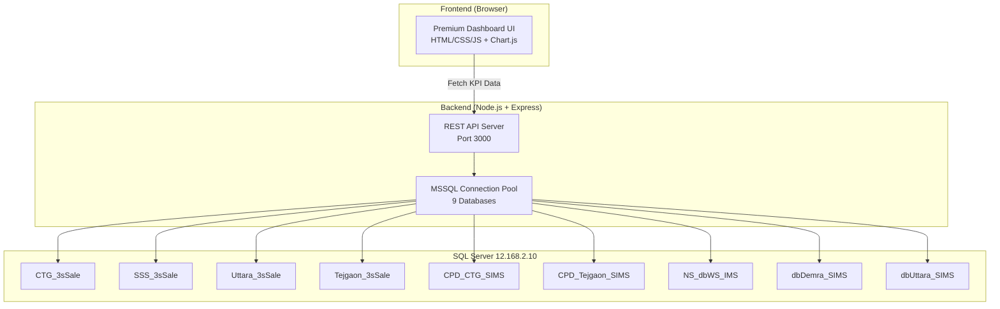

# KPI Management Dashboard — Implementation Plan

## Overview

Build a Power BI-style KPI management dashboard as a web application (Node.js + Express backend with MSSQL connectivity, and a premium HTML/CSS/JS frontend). The dashboard connects to **9 databases** on server `12.168.2.10`:

| Type | Database Name | SQL File |
|------|--------------|----------|
| **Service** | CTG_3sSale | CTG_3sSale.sql |
| **Service** | SSS_3sSale | SSS_3sSale.sql |
| **Service** | Uttara_3sSale | Uttara_3sSale.sql |
| **Service** | Tejgaon_3sSale | Tejgaon_3sSale.sql |
| **Parts** | CPD_CTG_SIMS | CPD_CTG_SIMS.sql |
| **Parts** | CPD_Tejgaon_SIMS | CPD_Tejgaon_SIMS.sql |
| **Parts** | NS_dbWS_IMS | NS_dbWS_IMS.sql |
| **Parts** | dbDemra_SIMS | dbDemra_SIMS.sql |
| **Parts** | dbUttara_SIMS | dbUttara_SIMS.sql |

---

## User Review Required

> [!IMPORTANT]
> **Database Credentials in Code**: The connection uses `user: dbrobin`, `pass: robin&123` on server `12.168.2.10`. These will be stored in a `.env` file. Please ensure this server is accessible from the machine running the dashboard.

> [!WARNING]
> **Database Names Assumption**: I'm inferring database names from the SQL filenames (e.g., `CTG_3sSale.sql` → database `CTG_3sSale`). Please confirm these are correct, or provide the actual database names if different.

## Open Questions

1. **Authentication**: Should the dashboard have user login/password authentication, or is it open access on the local network?
2. **Database names**: Are the database names exactly `CTG_3sSale`, `SSS_3sSale`, `Uttara_3sSale`, `Tejgaon_3sSale`, `CPD_CTG_SIMS`, `CPD_Tejgaon_SIMS`, `NS_dbWS_IMS`, `dbDemra_SIMS`, `dbUttara_SIMS`?
3. **Currency**: Is all monetary data in BDT (Bangladeshi Taka)?

---

## Architecture

---

## KPI Categories & Data Source Mapping

### 1. Operations Dashboard (Service DBs)

| KPI | Source Tables | Query Logic |
|-----|-------------|-------------|
| **Appointment Requests** | `tbAppointment` | COUNT where `Schedule_Date` in period |
| **Proposals Created** | `tbEstimate` | COUNT where `dDate` in period |
| **Proposals Outstanding** | `tbEstimate` | COUNT where no linked `tbJob` record |
| **Jobs Created** | `tbJob` | COUNT where `dDate` in period, `Cancelled=0` |
| **Jobs Scheduled** | `tbSchedule` + `tbJob` | COUNT with schedule records |
| **Jobs Completed** | `tbProdFinished` / `tbCloseJobDate` + `tbBill` | Jobs that have invoice/bill |
| **Jobs Worked** | `tbStallWorkTime` | DISTINCT jobs with work time entries |
| **Jobs Open** | `tbJob` | Jobs without bill (not in `H_Invoice_JOB`), `Cancelled=0` |
| **Job Completion Rate** | Computed | `(Jobs Completed / Jobs Created) × 100` |
| **Booking Time Completion** | `tbJob` | AVG(`Promised_Time - Receive_Time`) vs actual |
| **Jobs per Tech** | `tbStallWorkTime` + `tbEmployee_Information` | DISTINCT jobs / tech count |
| **Revenue per Tech** | `tbPayments` + `tbStallWorkTime` | Total revenue / active tech count |

### 2. Sales (Service + Parts DBs)

| KPI | Source Tables | Query Logic |
|-----|-------------|-------------|
| **Total Revenue** | Service: `tbPayments.mPayment_Amt`, Parts: `tbFTrans_Dt.Rate * R_InvQty` | SUM across all |
| **Month to Date Revenue** | Same as above | WHERE date >= 1st of current month |
| **Last Month's Revenue** | Same | WHERE date in last month |
| **Expense** | `tbPurchase` + `tbPurchaseDetail` (service), Parts: purchase tables | SUM of purchase amounts |
| **Cancellation Rate** | `tbJob` | `Cancelled=1 / Total Jobs × 100` |
| **Average Quote Value** | `tbEstimate.mAmount` | AVG |
| **Revenue Growth (YoY)** | Computed | `(This Year Rev - Last Year Rev) / Last Year Rev × 100` |

### 3. Financial Ratios (Computed from Service + Parts)

| KPI | Formula |
|-----|---------|
| **Gross Profit** | Total Revenue - Cost of Goods |
| **Gross Profit Margin** | `Gross Profit / Revenue × 100` |
| **Net Profit Margin** | `(Revenue - COGS - Expenses) / Revenue × 100` |
| **Cost of Goods** | Parts: `tbFTrans_Dt.WAvgPrice * R_InvQty`, Service: `tbPurchaseDetail.mP_Price * nQty` |
| **Revenue per Employee** | `Total Revenue / Active Employee Count` |
| **Profit Margin $** | Revenue - Total Costs |
| **Cash Balance** | `tbPayments` SUM where `vPayment_Mode = 'Cash'` |
| **Accounts Receivable** | `tbCustomer.mDue` (service) / `tbLedger.Balance` (parts) |
| **Revenue by Customer Type** | `tbJob.CType` + `tbPayments` GROUP BY type |
| **Accounts Payable Outstanding** | Purchases without full payment |
| **Labor Cost Percentage** | `Labor Revenue / Total Revenue × 100` |
| **Average Job Value** | `Total Revenue / Total Jobs` |
| **Quick Ratio** | `(Cash + Receivables) / Payables` |

### 4. Team/HR (Service + Parts DBs)

| KPI | Source | Logic |
|-----|--------|-------|
| **Employee Count by Role** | `tbEmployee_Information` + `tbDesignation` | GROUP BY designation, WHERE `Active_Tag=1` |

### 5. Time Period Filters

All KPIs support these filters:
- Today, This Week, This Month, This Year, This Year to Date
- This Year Quarter, Last Month, Last Year, Last Year Quarter, Last Year to Date

---

## Proposed Changes

### Backend — Node.js Express API

#### [NEW] `package.json`
- Dependencies: `express`, `mssql`, `dotenv`, `cors`
- Scripts: `dev` (nodemon), `start`

#### [NEW] `.env`
- Database server, credentials, all 9 database names

#### [NEW] `server.js`
- Express server setup, CORS, static file serving
- Health check endpoint

#### [NEW] `db.js`
- Connection pool manager for all 9 databases
- Shared pool instances with lazy initialization

#### [NEW] `routes/kpi.js`
- `GET /api/kpi/operations` — All operations KPIs
- `GET /api/kpi/sales` — Sales KPIs with comparison
- `GET /api/kpi/financial` — Financial ratios
- `GET /api/kpi/hr` — Team/HR metrics
- `GET /api/kpi/dashboard` — Combined overview
- Query params: `period` (today/week/month/year/ytd/quarter/lastMonth/lastYear/lastYearQuarter/lastYearYTD), `branch` (all/ctg/sss/uttara/tejgaon)

#### [NEW] `queries/serviceQueries.js`
- SQL query builders for service databases
- Date range parameterization

#### [NEW] `queries/partsQueries.js`
- SQL query builders for parts databases

---

### Frontend — Premium Dashboard UI

#### [NEW] `public/index.html`
- Main SPA structure with sidebar navigation
- KPI category sections (Operations, Sales, Financial, Team/HR)
- Time period selector toolbar
- Branch/location filter

#### [NEW] `public/css/styles.css`
- Dark-mode glassmorphism design system
- CSS custom properties for theming
- Card components, grid layouts, animations
- Responsive breakpoints

#### [NEW] `public/js/app.js`
- Main application controller
- API client for fetching KPI data
- Dynamic card rendering
- Chart.js integration for visualizations
- Period/branch filter handling
- Auto-refresh capability

#### [NEW] `public/js/charts.js`
- Chart configuration and rendering
- Revenue trends (line chart)
- Job distribution (doughnut)
- Employee breakdown (bar chart)
- Comparison charts (grouped bar)

---

## UI Design Concept

The dashboard will feature:
- **Dark theme** with deep navy/charcoal background
- **Glassmorphism cards** with backdrop blur effects
- **Gradient accent colors**: Electric blue → Purple → Teal
- **Animated counters** for KPI values
- **Sparkline mini-charts** inside KPI cards
- **Interactive sidebar** with category navigation
- **Top toolbar** with time period pills and branch selector
- **Responsive grid** adapting from 4 columns (desktop) to 1 (mobile)
- **Hover effects** with card elevation and glow
- **Real-time feel** with periodic data refresh

---

## Verification Plan

### Automated Tests
1. `npm start` — Server starts without errors
2. API endpoints return valid JSON with correct structure
3. Frontend loads and renders all KPI categories

### Manual Verification
1. Open dashboard in browser at `http://localhost:3000`
2. Verify all KPI cards display with proper formatting
3. Test time period filters (Today, This Month, etc.)
4. Test branch filter switching
5. Verify charts render correctly
6. Check responsive layout on different screen sizes

> [!NOTE]
> If the database server `12.168.2.10` is not accessible during development, the app will show connection error indicators on the cards and gracefully handle the failure. We can test the UI layout and interactions independently.
