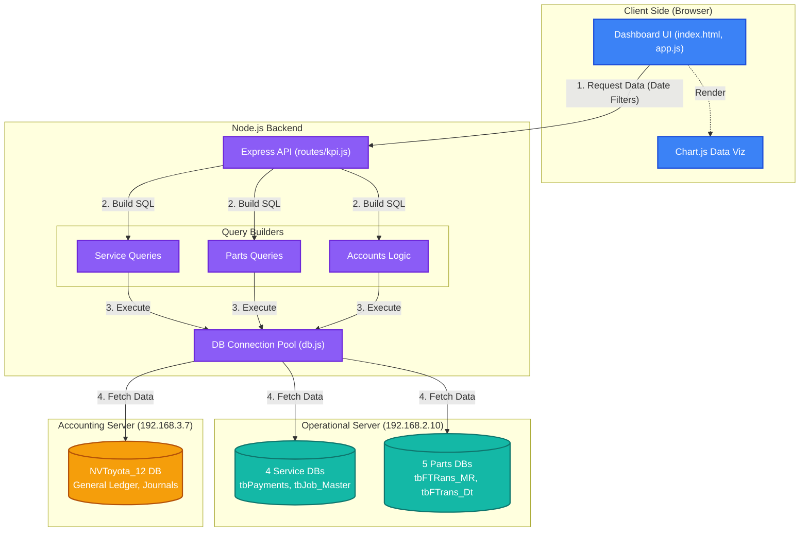
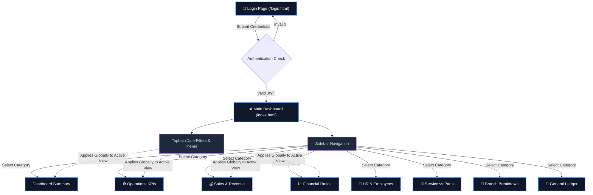

# KPI Management Dashboard — Walkthrough

## What Was Built

A full-stack **Power BI-style KPI Management Dashboard** connecting to **9 MSSQL databases** (4 service + 5 parts) with a premium dark-theme glassmorphism UI.

## Architecture

```
d:\SVC\KPI\
├── .env                          # DB credentials & config
├── server.js                     # Express server entry point
├── db.js                         # MSSQL connection pool manager (9 DBs)
├── package.json                  # Node.js project config
├── routes/
│   └── kpi.js                    # 7 API endpoints for all KPI categories
├── queries/
│   ├── serviceQueries.js         # SQL builders for 4 service DBs
│   └── partsQueries.js           # SQL builders for 5 parts DBs
└── public/
    ├── index.html                # Single-page dashboard app
    ├── css/styles.css            # Dark glassmorphism design system
    └── js/
        ├── app.js                # Main app controller & data binding
        └── charts.js             # Chart.js wrapper (line, bar, doughnut)
```

### System Architecture & Database Flow



### User Navigation Flow



## KPI Coverage (40+ KPIs)

| Category | KPIs |
|----------|------|
| **Dashboard** | Total Revenue, Gross Profit, Jobs Created, Employees, Open Jobs, Appointments, Completion Rate, Cancellation Rate + Revenue Trend Chart + Customer Type Donut |
| **Operations** | Appointment Requests, Proposals Created/Outstanding, Jobs Created/Scheduled/Completed/Worked/Open, Completion Rate, Booking Time Completion, Jobs per Tech, Cancellation Rate |
| **Sales** | Total/Service/Parts Revenue, MTD Revenue, Last Month Revenue, Expense, Cancellation Rate, Avg Quote Value, Revenue per Tech, YoY Growth + Monthly Trend Chart |
| **Financial** | Total Revenue, MTD, Last Month, COGS, Gross/Net Profit & Margins, Cash Balance, AR, AP, Revenue per Employee, Quick Ratio, Labor Cost %, Avg Job Value, YoY Growth |
| **Team/HR** | Total Employees, Service/Parts breakdown, Employee Count by Role (chart), Branch breakdown (table) |

## Time Period Filters

All KPIs support: **Today, This Week, This Month, This Year, YTD, This Quarter, Last Month, Last Year, Last Year Quarter, Last Year YTD**

## API Endpoints

| Endpoint | Description |
|----------|-------------|
| `GET /api/health` | Health check |
| `GET /api/kpi/dashboard?period=` | Combined overview |
| `GET /api/kpi/operations?period=` | Operations KPIs |
| `GET /api/kpi/sales?period=` | Sales & Revenue KPIs |
| `GET /api/kpi/financial?period=` | Financial Ratios |
| `GET /api/kpi/hr` | Team/HR metrics |
| `GET /api/kpi/revenue-trend?period=` | Monthly revenue trend |
| `GET /api/kpi/customer-type?period=` | Revenue by customer type |

## Verification Results

| Test | Result |
|------|--------|
| Server starts | ✅ Runs on port 3000 |
| Health endpoint | ✅ Returns `{"status":"ok"}` |
| HTML serves | ✅ Full dashboard HTML returned |
| CSS/JS static files | ✅ Served correctly |
| DB connections | ⚠️ Times out from dev machine (expected — server `12.168.2.10` is on LAN) |

## How to Run

```bash
cd d:\SVC\KPI
npm start
# Open http://localhost:3000 in your browser
```

> [!NOTE]
> The dashboard must be run from a machine on the same network as the database server `12.168.2.10` for data to load. The UI will show "Disconnected" and cards will stay in loading state if the DB is unreachable.
